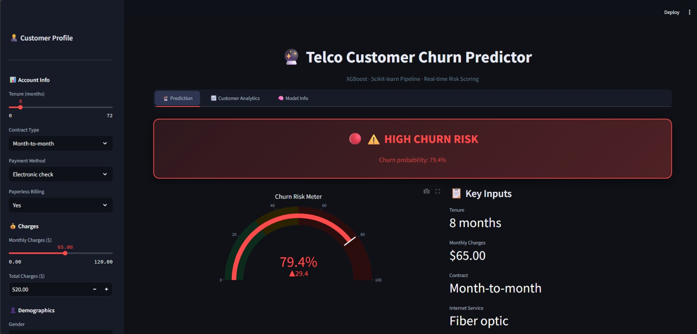
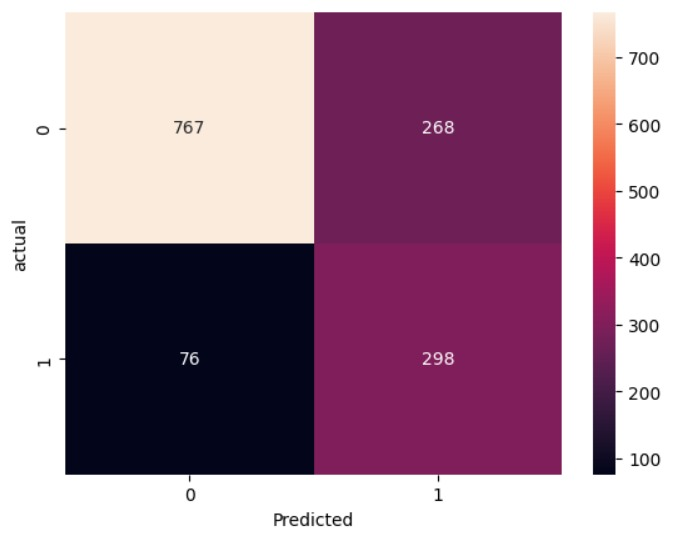

# 📡 Telco Customer Churn Prediction & Analytics Dashboard

An end-to-end Machine Learning project designed to predict customer churn for a telecommunications company. This project features a robust **XGBoost Pipeline** and a real-time **Streamlit Dashboard** for business intelligence and "What-If" analysis.

### 📊 Project Preview



## 🚀 Live Demo Features
- **Real-time Prediction:** Predict whether a customer will leave or stay based on their profile.
- **Risk Meter:** Visual representation of churn probability using a Gauge Chart.
- **Business Insights:** Automatic recommendations based on customer contract and service types.
- **Market Benchmarking:** Visual comparison of customer metrics (Tenure & Charges) against company averages.

## 🛠️ Technical Stack
- **Language:** Python 3.12
- **Libraries:** Scikit-Learn, XGBoost, Pandas, Plotly
- **Deployment:** Streamlit
- **Preprocessing:** Scikit-Learn Pipelines (StandardScaler for numericals, OneHotEncoder for categoricals)

## 📊 Model Performance
To handle class imbalance (Churn vs. Stay), the model was optimized using `scale_pos_weight=2.5`, achieving a balanced performance:
- **Recall (Churners):** ~79%
- **Recall (Non-Churners):** ~74%
- **Optimization:** Hyperparameter tuning via `GridSearchCV`

## 📁 Project Structure
```text
├── app.py                   # Streamlit dashboard script
├── final_telco_churn_model.pkl  # Pre-trained XGBoost Pipeline
├── WA_Fn-UseC_-Telco-Customer-Churn.csv  # Dataset
└── README.md                # Project documentation
